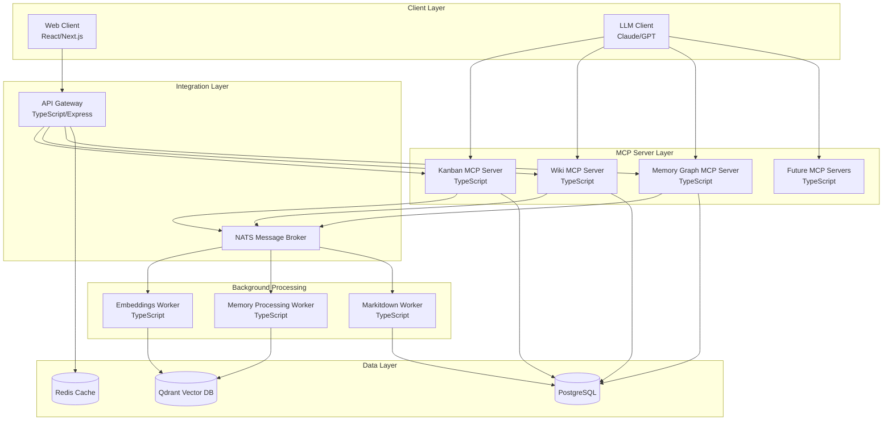

# MCP Tools System Architecture

## System Overview

A comprehensive multi-server MCP (Model Context Protocol) ecosystem designed to provide LLMs with advanced work management, documentation, and memory persistence capabilities.

📋 **Related Documentation**:
- [Detailed MCP Server Components](MCP_SERVER_DETAILS.md)
- [Backend Integration Layer](BACKEND_INTEGRATION.md)
- [TypeScript Workers Architecture](WORKERS_ARCHITECTURE.md)
- [Web Client Architecture](WEB_CLIENT_ARCHITECTURE.md)
- [Data Flow Diagrams](DATA_FLOW_DIAGRAMS.md)
- [API Specifications](API_SPECIFICATIONS.md)
- [Future Services Roadmap](FUTURE_SERVICES.md)

## High-Level Architecture



## Core Components

### 1. MCP Servers (TypeScript)

#### Kanban MCP Server
- **Purpose**: Task and project management
- **Tools**: 
  - `create_board`, `create_task`, `update_task`, `move_task`
  - `get_board`, `list_boards`, `archive_board`
  - `add_comment`, `assign_user`, `set_priority`
- **Resources**: Board configurations, task templates
- **Data**: Tasks, boards, assignments, comments
- 📋 **Detailed Design**: [MCP Server Details](MCP_SERVER_DETAILS.md#kanban-mcp-server)
- 🔌 **API Reference**: [Kanban API](API_SPECIFICATIONS.md#kanban-mcp-server-api)

#### Wiki MCP Server  
- **Purpose**: Knowledge management and documentation
- **Tools**:
  - `create_page`, `update_page`, `delete_page`
  - `search_content`, `link_pages`, `create_template`
  - `upload_attachment`, `create_category`
- **Resources**: Page templates, category structures
- **Data**: Wiki pages, attachments, links, categories
- 📋 **Detailed Design**: [MCP Server Details](MCP_SERVER_DETAILS.md#wiki-mcp-server)
- 🔌 **API Reference**: [Wiki API](API_SPECIFICATIONS.md#wiki-mcp-server-api)

#### Memory Graph MCP Server
- **Purpose**: Long-term knowledge persistence and relationship mapping
- **Tools**:
  - `store_memory`, `retrieve_memory`, `create_connection`
  - `search_memories`, `get_related`, `create_concept`
  - `update_context`, `merge_memories`
- **Resources**: Memory schemas, relationship types
- **Data**: Memory nodes, relationships, contexts, concepts
- 📋 **Detailed Design**: [MCP Server Details](MCP_SERVER_DETAILS.md#memory-graph-mcp-server)
- 🔌 **API Reference**: [Memory API](API_SPECIFICATIONS.md#memory-graph-mcp-server-api)

### 2. Integration Layer

#### API Gateway (TypeScript/Express)
```typescript
interface APIGateway {
  // Unified REST API for web client
  routes: {
    '/api/kanban/*': KanbanRoutes;
    '/api/wiki/*': WikiRoutes;
    '/api/memory/*': MemoryRoutes;
    '/api/search/*': SearchRoutes;
  };
  
  // WebSocket for real-time updates
  websocket: WebSocketServer;
  
  // Cross-server operations
  crossServerSearch(query: string): Promise<SearchResult[]>;
  generateInsights(): Promise<Insight[]>;
}
```

#### NATS Message Broker
- **Purpose**: Async communication between servers and workers
- **Subjects**:
  - `mcp.kanban.task.created`
  - `mcp.wiki.page.updated`
  - `mcp.memory.node.stored`
  - `mcp.vector.index.request`
  - `mcp.relationship.analyze`

### 3. Background Workers (TypeScript)

📦 **Detailed Implementation**: [TypeScript Workers Architecture](WORKERS_ARCHITECTURE.md)

#### Embeddings Worker
```typescript
export class EmbeddingsWorker {
    // Processes content for vector embeddings
    async processKanbanTask(task: Task): Promise<void>;
    async processWikiPage(page: WikiPage): Promise<void>;
    async processMemoryNode(memory: MemoryNode): Promise<void>;
    
    // Updates Qdrant collections
    async updateVectors(content: VectorContent[]): Promise<void>;
}
```

#### Memory Processing Worker
```typescript
export class MemoryProcessingWorker {
    // Analyzes content for relationships
    async findRelationships(content: Content): Promise<Relationship[]>;
    
    // Updates relationship graph
    async updateGraph(relationships: Relationship[]): Promise<void>;
}
```

### 4. Data Layer

🔗 **Integration Details**: [Backend Integration Layer](BACKEND_INTEGRATION.md)

#### Qdrant Vector Database
```yaml
Collections:
  kanban_tasks:
    vector_size: 1536
    metadata: [board_id, priority, assignee, tags]
  
  wiki_pages:
    vector_size: 1536
    metadata: [category, author, last_modified, tags]
  
  memory_nodes:
    vector_size: 1536
    metadata: [context, concept_type, relationships, timestamp]
  
  cross_references:
    vector_size: 1536
    metadata: [source_type, target_type, relationship_type]
```

#### PostgreSQL Schema
```sql
-- Shared tables
CREATE TABLE users (
    id UUID PRIMARY KEY,
    name VARCHAR NOT NULL,
    email VARCHAR UNIQUE NOT NULL
);

-- Kanban tables
CREATE TABLE boards (
    id UUID PRIMARY KEY,
    name VARCHAR NOT NULL,
    owner_id UUID REFERENCES users(id)
);

CREATE TABLE tasks (
    id UUID PRIMARY KEY,
    board_id UUID REFERENCES boards(id),
    title VARCHAR NOT NULL,
    content TEXT,
    vector_id VARCHAR -- Qdrant point ID
);

-- Wiki tables
CREATE TABLE wiki_pages (
    id UUID PRIMARY KEY,
    title VARCHAR NOT NULL,
    content TEXT NOT NULL,
    vector_id VARCHAR -- Qdrant point ID
);

-- Memory tables
CREATE TABLE memory_nodes (
    id UUID PRIMARY KEY,
    content TEXT NOT NULL,
    context JSONB,
    vector_id VARCHAR -- Qdrant point ID
);

CREATE TABLE relationships (
    id UUID PRIMARY KEY,
    source_id UUID NOT NULL,
    target_id UUID NOT NULL,
    relationship_type VARCHAR NOT NULL,
    strength FLOAT DEFAULT 1.0
);
```

## Data Flow

📊 **Detailed Flow Diagrams**: [Data Flow Documentation](DATA_FLOW_DIAGRAMS.md)

### 1. Content Creation Flow
```
LLM → MCP Server → PostgreSQL → NATS → Vector Worker → Qdrant
                              → NATS → Relationship Worker → Qdrant
```

### 2. Search Flow
```
LLM/Web → API Gateway → Qdrant (vector search) → PostgreSQL (full data) → Response
```

### 3. Cross-Reference Flow
```
Any Content Change → NATS → Relationship Worker → Analysis → Update Relationships
```

## Web Client Architecture (React/Next.js)

⚛️ **Complete Implementation**: [Web Client Architecture](WEB_CLIENT_ARCHITECTURE.md)

```typescript
// Component Structure
src/
├── components/
│   ├── kanban/
│   │   ├── BoardView.tsx
│   │   ├── TaskCard.tsx
│   │   └── TaskForm.tsx
│   ├── wiki/
│   │   ├── PageEditor.tsx
│   │   ├── PageView.tsx
│   │   └── SearchResults.tsx
│   ├── memory/
│   │   ├── GraphView.tsx
│   │   ├── MemoryNode.tsx
│   │   └── RelationshipMap.tsx
│   └── shared/
│       ├── SearchBar.tsx
│       ├── CrossReferences.tsx
│       └── InsightPanel.tsx
├── pages/
│   ├── kanban/
│   ├── wiki/
│   ├── memory/
│   └── dashboard/
└── hooks/
    ├── useWebSocket.ts
    ├── useCrossSearch.ts
    └── useInsights.ts
```

## Deployment Architecture

```yaml
# Docker Compose Structure
services:
  # MCP Servers
  kanban-mcp:
    build: ./servers/kanban
    ports: ["3001:3001"]
  
  wiki-mcp:
    build: ./servers/wiki
    ports: ["3002:3002"]
    
  memory-mcp:
    build: ./servers/memory
    ports: ["3003:3003"]
  
  # Integration Layer
  api-gateway:
    build: ./gateway
    ports: ["3000:3000"]
    depends_on: [kanban-mcp, wiki-mcp, memory-mcp]
  
  # Web Client
  web-client:
    build: ./web
    ports: ["3010:3010"]
  
  # Background Workers
  embeddings-worker:
    build: ./workers/embeddings
    ports: ["3004:3004"]
    
  memory-processing-worker:
    build: ./core
    command: ["node", "dist/services/memory-processing/index.js"]
    
  markitdown-worker:
    build: ./workers/markitdown
    ports: ["3005:3005"]
  
  # Infrastructure
  nats:
    image: nats:latest
    
  qdrant:
    image: qdrant/qdrant:latest
    
  postgres:
    image: postgres:15
    
  redis:
    image: redis:7
```

## Security Considerations

- **Authentication**: JWT tokens shared across all services
- **Authorization**: Role-based access control (RBAC)
- **Data Encryption**: TLS for all communications, encrypted at rest
- **API Security**: Rate limiting, input validation, CORS policies
- **Vector Security**: Metadata-based access control in Qdrant

## Scalability Considerations

- **Horizontal Scaling**: Each MCP server can run multiple instances
- **Load Balancing**: NGINX for web tier, built-in for MCP servers  
- **Caching**: Redis for frequently accessed data
- **Background Processing**: NATS JetStream for reliable message processing
- **Database Scaling**: PostgreSQL read replicas, Qdrant clustering

## Development Phases

### Phase 1: Foundation
- Set up basic MCP server framework
- Implement Kanban MCP server
- Basic PostgreSQL schema
- Simple NATS integration

### Phase 2: Expansion  
- Wiki MCP server
- Memory Graph MCP server
- Vector indexing worker
- Basic web client

### Phase 3: Integration
- Cross-server search
- Relationship analysis
- Advanced web features
- Performance optimization

### Phase 4: Enhancement
- Additional MCP servers as needed
- Advanced analytics
- Mobile support
- Enterprise features

🚀 **Future Roadmap**: [Future Services](FUTURE_SERVICES.md)