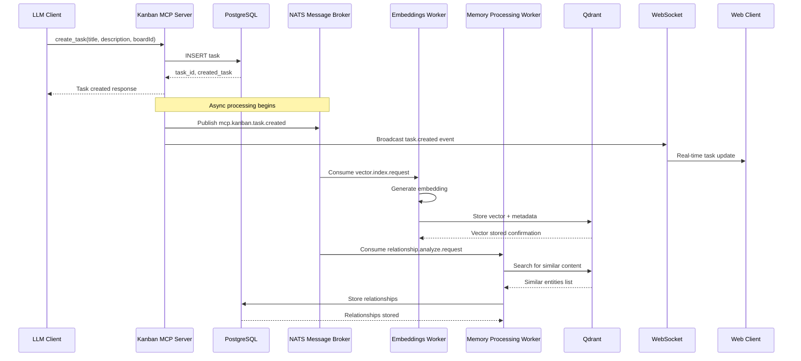
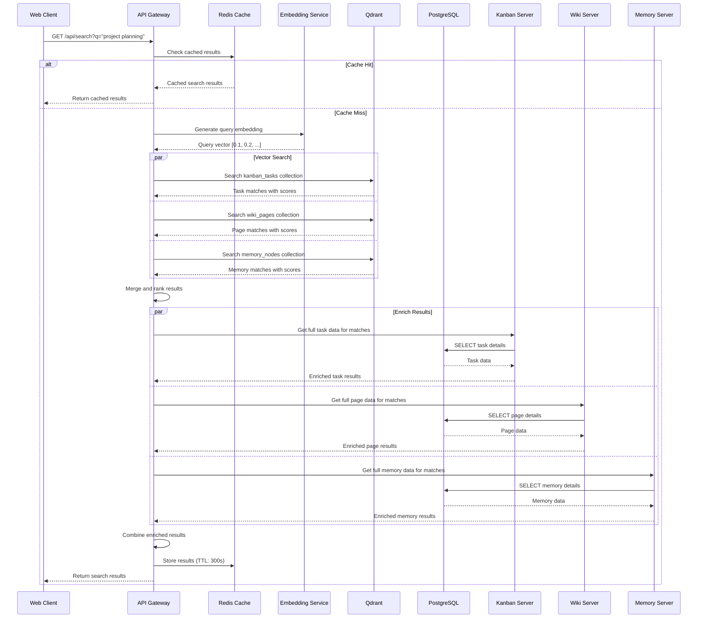
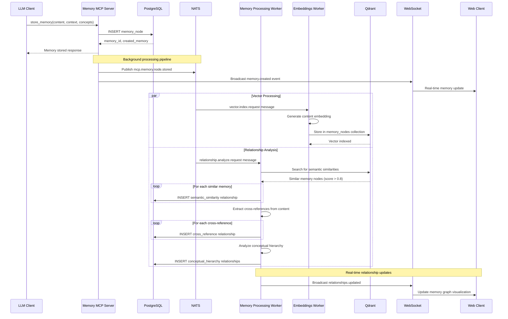
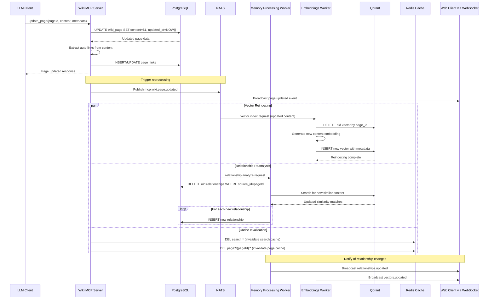
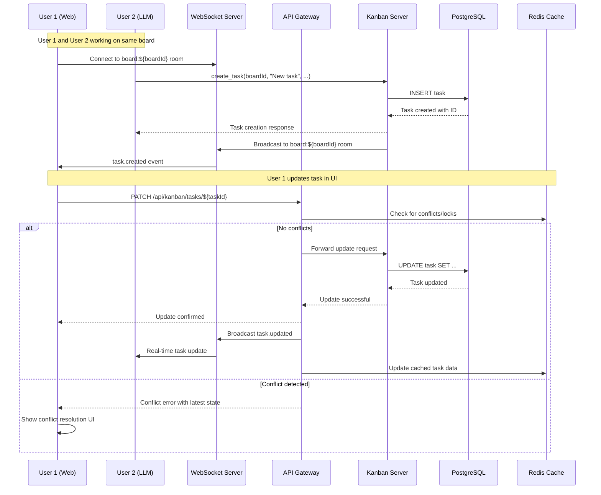
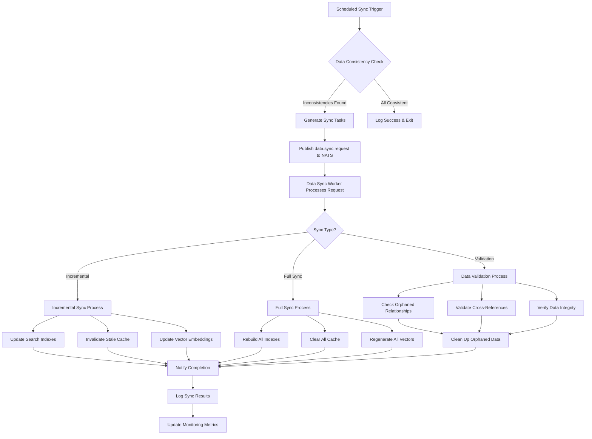
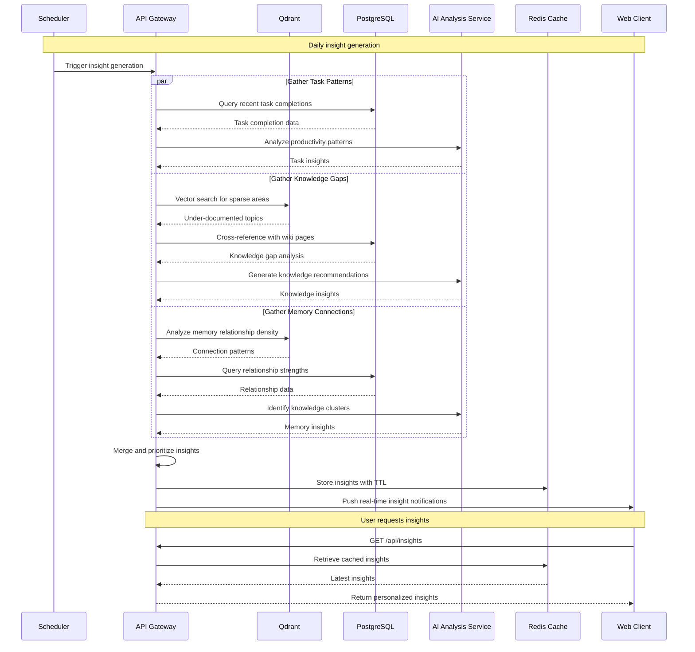
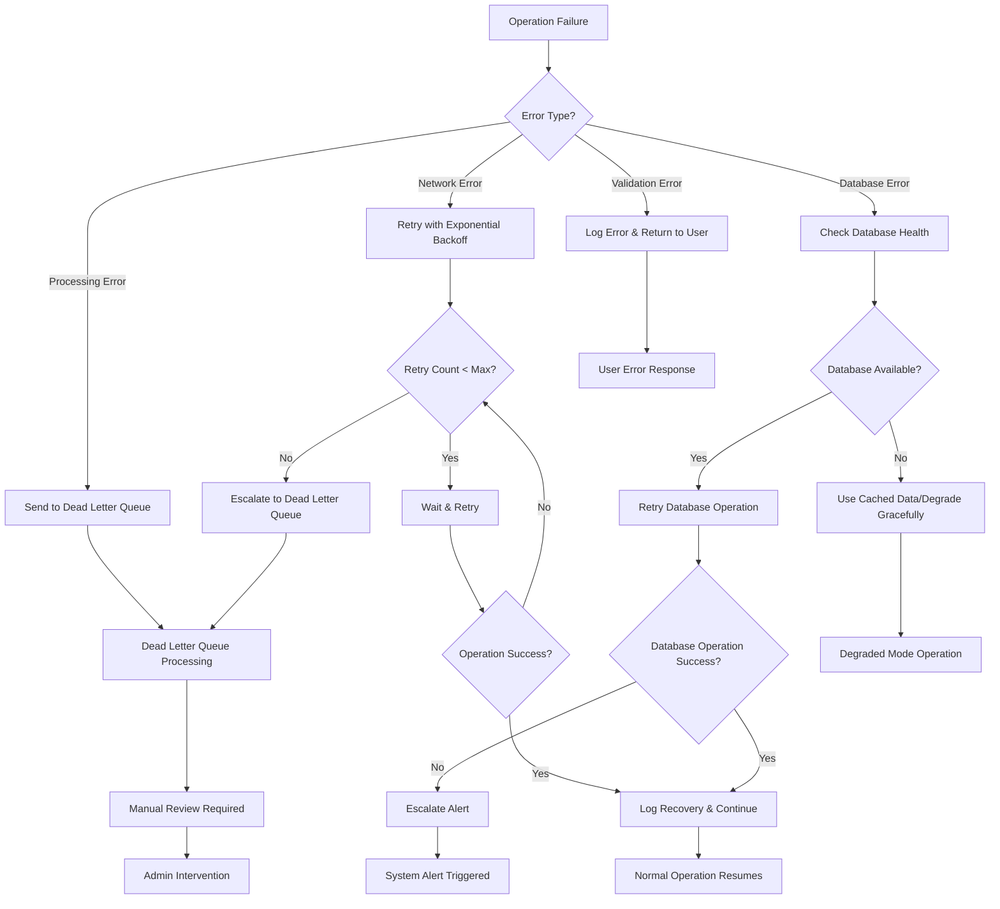

# Data Flow Diagrams

🔙 **Back to**: [Main Architecture](ARCHITECTURE.md) | 🔍 **See also**: [Backend Integration](BACKEND_INTEGRATION.md) | [API Specifications](API_SPECIFICATIONS.md)

## Overview

This document provides detailed data flow diagrams showing how information moves through the MCP Tools system, including inter-server communication, real-time updates, and background processing workflows.

## 1. Task Creation Flow

🔗 **Implementation**: [Kanban MCP Server](MCP_SERVER_DETAILS.md#kanban-mcp-server) | [Embeddings Worker](WORKERS_ARCHITECTURE.md#embeddings-worker)

## 2. Cross-Server Search Flow

🔗 **Implementation**: [API Gateway](BACKEND_INTEGRATION.md#api-gateway-design) | [Search API](API_SPECIFICATIONS.md#universal-search-api)

## 3. Memory Graph Creation and Relationship Discovery

🔗 **Implementation**: [Memory Server](MCP_SERVER_DETAILS.md#memory-graph-mcp-server) | [Memory Processing Worker](WORKERS_ARCHITECTURE.md#memory-processing-worker)

## 4. Wiki Page Update with Cross-Linking

🔗 **Implementation**: [Wiki MCP Server](MCP_SERVER_DETAILS.md#wiki-mcp-server) | [Cache Service](BACKEND_INTEGRATION.md#cache-service)

## 5. Real-Time Collaboration Flow

🔗 **Implementation**: [WebSocket Integration](WEB_CLIENT_ARCHITECTURE.md#websocket-integration) | [API Gateway](BACKEND_INTEGRATION.md#api-gateway-design)

## 6. Background Data Sync and Consistency

## 7. Insight Generation Pipeline

🔗 **Implementation**: [Insights API](API_SPECIFICATIONS.md#insights-api) | [Vector Service](BACKEND_INTEGRATION.md#vector-service-implementation)

## 8. Error Handling and Recovery Flow

## Key Data Flow Characteristics

### Asynchronous Processing
- All heavy operations (vector indexing, relationship analysis) happen asynchronously
- NATS ensures reliable message delivery with retries
- WebSocket provides real-time updates to connected clients

### Caching Strategy
- Redis caches frequent searches and computed insights
- Cache invalidation happens automatically on data changes
- TTL-based expiration for time-sensitive data

### Consistency Model
- Eventual consistency for search indexes and relationships
- Strong consistency for core entity data (tasks, pages, memories)
- Conflict resolution for concurrent updates

### Scalability Patterns
- Horizontal scaling of worker processes via NATS queue groups
- Database read replicas for query scaling
- Vector database clustering for search performance
- CDN for static assets and cached responses

### Monitoring Points
- Message processing rates and latencies
- Database connection pool utilization
- Vector search performance metrics
- WebSocket connection counts
- Cache hit/miss ratios
- Error rates and recovery success rates

## Next Steps

- 📋 **Implementation Details**: [MCP Server Details](MCP_SERVER_DETAILS.md)
- 🔗 **Backend Systems**: [Backend Integration](BACKEND_INTEGRATION.md)
- 📦 **Worker Processes**: [TypeScript Workers](WORKERS_ARCHITECTURE.md)
- ⚛️ **Frontend Integration**: [Web Client Architecture](WEB_CLIENT_ARCHITECTURE.md)
- 🔌 **API Reference**: [API Specifications](API_SPECIFICATIONS.md)