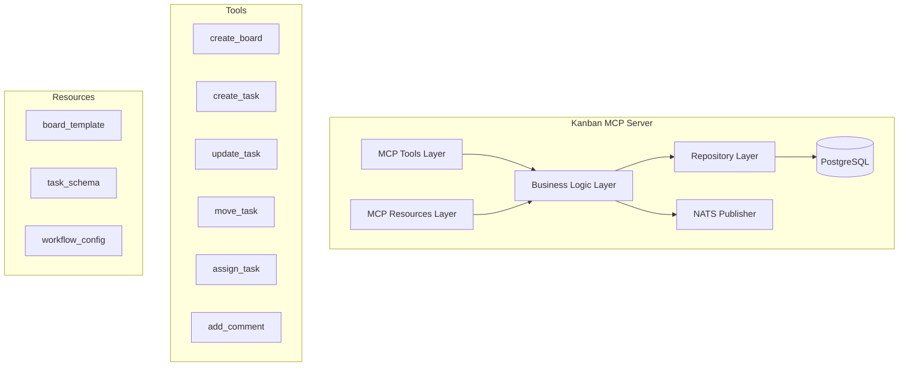
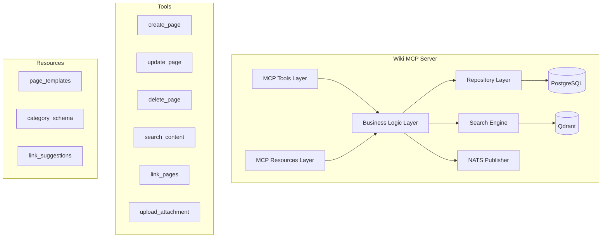
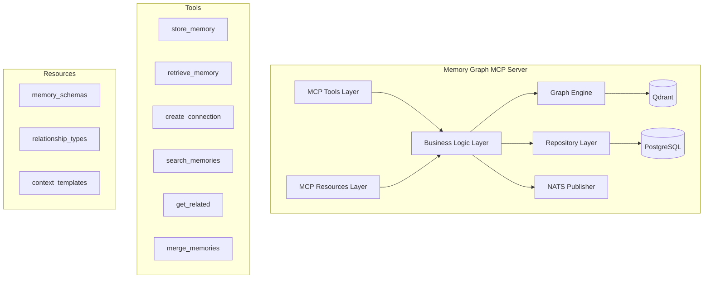

# MCP Server Detailed Component Design

🔙 **Back to**: [Main Architecture](ARCHITECTURE.md) | 🔍 **See also**: [API Specifications](API_SPECIFICATIONS.md) | [Data Flow Diagrams](DATA_FLOW_DIAGRAMS.md)

## Kanban MCP Server

🔗 **Related**: [Backend Integration](BACKEND_INTEGRATION.md) | [API Specs](API_SPECIFICATIONS.md#kanban-mcp-server-api)

### Architecture


### TypeScript Implementation Structure
```typescript
// src/tools/
export interface KanbanTools {
  create_board(args: CreateBoardArgs): Promise<Board>;
  create_task(args: CreateTaskArgs): Promise<Task>;  
  update_task(args: UpdateTaskArgs): Promise<Task>;
  move_task(args: MoveTaskArgs): Promise<Task>;
  assign_task(args: AssignTaskArgs): Promise<Task>;
  add_comment(args: AddCommentArgs): Promise<Comment>;
  get_board(args: GetBoardArgs): Promise<Board>;
  list_boards(args: ListBoardsArgs): Promise<Board[]>;
  archive_board(args: ArchiveBoardArgs): Promise<void>;
}

// src/services/
export class KanbanService {
  constructor(
    private repo: KanbanRepository,
    private nats: NatsPublisher,
    private vectorClient: QdrantClient
  ) {}
  
  async createTask(data: CreateTaskData): Promise<Task> {
    const task = await this.repo.createTask(data);
    
    // Publish for vector indexing
    await this.nats.publish('mcp.kanban.task.created', {
      taskId: task.id,
      content: task.description,
      metadata: {
        boardId: task.boardId,
        priority: task.priority,
        tags: task.tags
      }
    });
    
    return task;
  }
}

// src/repositories/
export class KanbanRepository {
  constructor(private db: Database) {}
  
  async createTask(data: CreateTaskData): Promise<Task> {
    return await this.db.task.create({
      data: {
        ...data,
        id: crypto.randomUUID(),
        createdAt: new Date(),
        updatedAt: new Date()
      }
    });
  }
}
```

## Wiki MCP Server

🔗 **Related**: [Backend Integration](BACKEND_INTEGRATION.md) | [API Specs](API_SPECIFICATIONS.md#wiki-mcp-server-api)

### Architecture  


### TypeScript Implementation Structure
```typescript
// src/tools/
export interface WikiTools {
  create_page(args: CreatePageArgs): Promise<WikiPage>;
  update_page(args: UpdatePageArgs): Promise<WikiPage>;
  delete_page(args: DeletePageArgs): Promise<void>;
  search_content(args: SearchArgs): Promise<SearchResult[]>;
  link_pages(args: LinkPagesArgs): Promise<PageLink>;
  create_template(args: CreateTemplateArgs): Promise<Template>;
  upload_attachment(args: UploadArgs): Promise<Attachment>;
  create_category(args: CreateCategoryArgs): Promise<Category>;
}

// src/services/
export class WikiService {
  constructor(
    private repo: WikiRepository,
    private search: SearchService,
    private nats: NatsPublisher
  ) {}
  
  async createPage(data: CreatePageData): Promise<WikiPage> {
    const page = await this.repo.createPage(data);
    
    // Extract and create automatic links
    const links = this.extractLinks(page.content);
    await this.createAutoLinks(page.id, links);
    
    // Publish for vector indexing
    await this.nats.publish('mcp.wiki.page.created', {
      pageId: page.id,
      content: page.content,
      metadata: {
        title: page.title,
        category: page.category,
        tags: page.tags,
        author: page.authorId
      }
    });
    
    return page;
  }
  
  async searchContent(query: string): Promise<SearchResult[]> {
    // Hybrid search: vector + full-text
    const vectorResults = await this.search.vectorSearch(query);
    const textResults = await this.search.fullTextSearch(query);
    
    return this.mergeSearchResults(vectorResults, textResults);
  }
}
```

## Memory Graph MCP Server

🔗 **Related**: [Backend Integration](BACKEND_INTEGRATION.md) | [API Specs](API_SPECIFICATIONS.md#memory-graph-mcp-server-api)

### Architecture


### TypeScript Implementation Structure
```typescript
// src/tools/
export interface MemoryTools {
  store_memory(args: StoreMemoryArgs): Promise<MemoryNode>;
  retrieve_memory(args: RetrieveArgs): Promise<MemoryNode[]>;
  create_connection(args: ConnectionArgs): Promise<Relationship>;
  search_memories(args: SearchArgs): Promise<MemorySearchResult[]>;
  get_related(args: RelatedArgs): Promise<RelatedMemories>;
  create_concept(args: ConceptArgs): Promise<Concept>;
  update_context(args: ContextArgs): Promise<MemoryNode>;
  merge_memories(args: MergeArgs): Promise<MemoryNode>;
}

// src/services/
export class MemoryService {
  constructor(
    private repo: MemoryRepository,
    private graph: GraphEngine,
    private nats: NatsPublisher
  ) {}
  
  async storeMemory(data: StoreMemoryData): Promise<MemoryNode> {
    const memory = await this.repo.storeMemory(data);
    
    // Find potential relationships
    const related = await this.graph.findSimilar(memory.content, 0.8);
    
    // Create relationships
    for (const relatedMemory of related) {
      await this.createConnection({
        sourceId: memory.id,
        targetId: relatedMemory.id,
        type: 'semantic_similarity',
        strength: relatedMemory.similarity
      });
    }
    
    // Publish for analysis
    await this.nats.publish('mcp.memory.node.stored', {
      memoryId: memory.id,
      content: memory.content,
      context: memory.context
    });
    
    return memory;
  }
  
  async getRelated(memoryId: string, depth: number = 2): Promise<RelatedMemories> {
    return await this.graph.traverse(memoryId, depth);
  }
}

// src/graph/
export class GraphEngine {
  constructor(
    private vector: QdrantClient,
    private repo: MemoryRepository
  ) {}
  
  async findSimilar(content: string, threshold: number): Promise<SimilarMemory[]> {
    const embedding = await this.generateEmbedding(content);
    
    const results = await this.vector.search('memory_nodes', {
      vector: embedding,
      limit: 10,
      score_threshold: threshold
    });
    
    return results.map(r => ({
      id: r.payload.memory_id,
      similarity: r.score
    }));
  }
  
  async traverse(startId: string, maxDepth: number): Promise<RelatedMemories> {
    const visited = new Set<string>();
    const result: RelatedMemories = { nodes: [], edges: [] };
    
    await this.traverseRecursive(startId, 0, maxDepth, visited, result);
    
    return result;
  }
}
```

## Shared MCP Framework Components

🔗 **Integration**: [Backend Integration Layer](BACKEND_INTEGRATION.md) | [TypeScript Workers](WORKERS_ARCHITECTURE.md)

### Base MCP Server Structure
```typescript
// src/framework/
export abstract class BaseMCPServer {
  protected server: Server;
  protected transport: Transport;
  
  constructor(
    protected config: ServerConfig,
    protected db: Database,
    protected nats: NatsClient
  ) {
    this.server = new Server({
      name: config.name,
      version: config.version
    }, {
      capabilities: {
        tools: {},
        resources: {}
      }
    });
    
    this.setupTools();
    this.setupResources();
  }
  
  protected abstract setupTools(): void;
  protected abstract setupResources(): void;
  
  async start(): Promise<void> {
    this.transport = new StdioServerTransport();
    await this.server.connect(this.transport);
  }
}

// Message Publishing
export class NatsPublisher {
  constructor(private nats: NatsConnection) {}
  
  async publish<T>(subject: string, data: T): Promise<void> {
    await this.nats.publish(subject, JSON.stringify(data));
  }
  
  async request<T, R>(subject: string, data: T): Promise<R> {
    const response = await this.nats.request(subject, JSON.stringify(data));
    return JSON.parse(response.data.toString());
  }
}

// Database Layer
export abstract class BaseRepository {
  constructor(protected db: Database) {}
  
  protected async withTransaction<T>(fn: (tx: Transaction) => Promise<T>): Promise<T> {
    return await this.db.transaction(fn);
  }
}
```

### Resource Management
```typescript
// src/framework/resources/
export class ResourceManager {
  private resources = new Map<string, ResourceHandler>();
  
  register(uri: string, handler: ResourceHandler): void {
    this.resources.set(uri, handler);
  }
  
  async get(uri: string): Promise<ResourceContent> {
    const handler = this.resources.get(uri);
    if (!handler) {
      throw new Error(`Resource not found: ${uri}`);
    }
    
    return await handler.get();
  }
}

export interface ResourceHandler {
  get(): Promise<ResourceContent>;
  watch?(): AsyncIterable<ResourceContent>;
}

// Example: Kanban board template resource
export class BoardTemplateResource implements ResourceHandler {
  constructor(private repo: KanbanRepository) {}
  
  async get(): Promise<ResourceContent> {
    const templates = await this.repo.getBoardTemplates();
    
    return {
      uri: "kanban://templates/boards",
      mimeType: "application/json",
      text: JSON.stringify(templates, null, 2)
    };
  }
}
```

## Configuration and Environment

### Server Configuration
```typescript
// config/
export interface ServerConfig {
  name: string;
  version: string;
  port: number;
  database: DatabaseConfig;
  nats: NatsConfig;
  qdrant: QdrantConfig;
  redis: RedisConfig;
}

export interface DatabaseConfig {
  host: string;
  port: number;
  database: string;
  username: string;
  password: string;
}

export interface NatsConfig {
  servers: string[];
  credentials?: string;
}

export interface QdrantConfig {
  host: string;
  port: number;
  apiKey?: string;
}
```

### Docker Configuration
```dockerfile
# Base Dockerfile for MCP servers
FROM node:18-alpine

WORKDIR /app

COPY package*.json ./
RUN npm ci --only=production

COPY dist/ ./dist/
COPY config/ ./config/

EXPOSE 3001

CMD ["node", "dist/index.js"]
```

This detailed design provides the foundation for implementing each MCP server with proper separation of concerns, type safety, and scalability considerations.

## Next Steps

- 📋 **Implementation Guide**: [Backend Integration](BACKEND_INTEGRATION.md)
- 📦 **Worker Processes**: [TypeScript Workers Architecture](WORKERS_ARCHITECTURE.md)  
- ⚛️ **Frontend Integration**: [Web Client Architecture](WEB_CLIENT_ARCHITECTURE.md)
- 📊 **System Flows**: [Data Flow Diagrams](DATA_FLOW_DIAGRAMS.md)